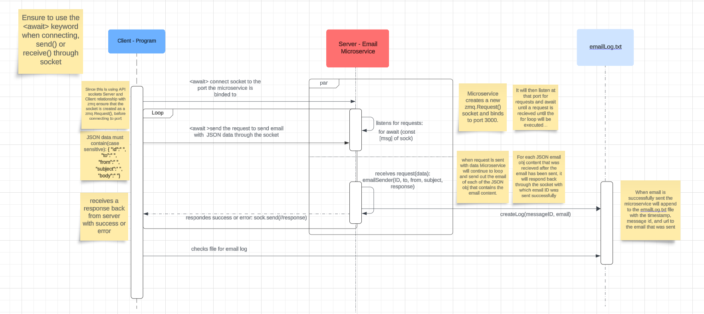

# READ ME #

## Things To Know First ##
The Email Microservice utilize ZeroMQ Socket API where the built-in Request-reply ZeroMQ pattern is used. The Microservice is the server that creates a zmq.Reply() socket that is bound to a TCP Port.  

## How To Programmatically REQUEST and RECEIVE Data From Microservice ##

### Programmatically REQUEST ###
In order to be able to programmatically REQUEST Data, you **MUST** first create a zmq.Request() socket that connects to the port the Microservice is bound too in an async function. It is also **important** to note when connecting the socket to the Microservice socket that it uses the keyword **await**. This is also necessary when either sending and requesting data.

**JavaScript example:**
```
    async function main() {

        const sock = new zmq.Request();
        await sock.connect('tcp://....'); //connect to the port that the Microservice is binded to 
        
    }
```
Now that the socket is set up to be connected to the Microservice to REQUEST data, a data must now be sent to the Microservice to make the REQUEST. For this Microservice, the sent data is **required** to be a JSON data in the format of:
``` 
    {
        "id":" ", //userID, messageID, etc.
        "to":" ",  //recipients email
        "from":" ", //sending from email
        "subject":" ", //email subject
        "body":" " //the content of the email
    }
```
**Example Call(JavaScript):**
```
//create async function
    async function main() {

        //create request() socket
        const sock = new zmq.Request();

        // await to connect to the Microservice port
        await sock.connect('tcp://....'); //connect to the port that the Microservice is binded to 
        
        //create JSON object
         var userObj = {
            "id":"test",
            "to":"recipient@email.com",
            "from":"test@email.com",
            "subject":"test",
            "body":"hello world!"
            }

        //stringify the JSON data before sending it or else the Microservice will recieve buffers
        var string = JSON.stringify(userObj)

        //send the request with the data with await keyword
        await sock.send(string);
    }
```


### Programmatically RECEIVE ###
It is important to understand in a server and client ZeroMQ socket pattern that the client side must wait and receive a data back before a new request can be made with await keyword.

**JavaScript example call to receive:**
```
     async function main() {
        //create socket and await connect to port...
        //create JSON data...
        //stringify JSON data...


        //sends await request with stringify JSON data
        await sock.send(string);

        //wait for function from Microservice to process...
        await sleep(4000); 

        //await recieve data from Microservice and store into const variable
        const response = await sock.recieve();

        //display to console...
        console.log(response);
     }
```

## Sequence UML Diagram ##

